# Experiments

Detailed run notes and results per stage. High-level roadmap and design live in the
[README](README.md). Everything runs on the NAS (`source /mnt/nas/data/RH20T/env.sh`).

Standing eval rule (learned in Stage 1): pair **RankMe** (label-free health / collapse detector) with
an **unsaturated, robot-relevant probe** (predict robot state, or contact/force), always
**scene-held-out** and **multi-seed**. One saturated metric will mislead you.

## Stages 0-1 — LeJEPA finetune on cfg3 video only

Pipeline verified end to end: cfg3 → 2.33M frames (799 scenes, 66 tasks) → 240 WebDataset shards →
DDP continue-LeJEPA from `OK-AI/lejepa-vitb16-pretrain-in1k` → eval.

**Result: finetuning on cfg3 video is a no-op — no help, no harm. Keep the warm-start (`e0`).**

- Hot LR (2e-4) collapsed RankMe 300→158. LR 2e-5 fixes it (RankMe ~285).
- The task-id probe drop (0.91→0.74) is a **saturated** metric — it tracks ImageNet appearance, not
  a real regression. (`probe_curve`)
- Robot-relevant eval (contact + force, 5-seed scene-held-out) is flat, and force-R²≈0 for every
  checkpoint. (`robust_robot_eval`, `contact_probe`)
- force-R²≈0 is the point: a single frame doesn't contain force, so vision alone can't encode it —
  which is exactly why Stage 2 adds robot_state.

Scripts: `extract_frames` → `make_shards` → `train` → `eval_lejepa` / `probe_curve` /
`robust_robot_eval` / `contact_probe`; `gate` for the video↔force alignment sanity check.

## Stage 2 — video + robot_state (verified)

Question: does fusing video + robot_state in one encoder learn genuine cross-modal structure — a
latent better than either modality alone — and is the gain *cross-modal*, not just compression?

**What we ran** (single timestep, cfg3 video + robot_state):

- Signal gate: frozen vision → state R² = **0.43** (tcp 0.73) — cross-modal signal is real, so
  building the fusion encoder is justified. (`step1_gate`)
- State loader: joints→sin/cos, tcp→symlog, quat→6D, F/T→symlog, gripper→symlog = 28-dim. (`state`)
- Vision features precomputed once from the frozen `e0` backbone as patch tokens (196×768).
  (`precompute_patch`)
- Encoder: **Perceiver** — learnable queries `CrossAttention` over [vision patch tokens + state
  token] → bottleneck latent. Vision backbone frozen; only the ~2M-param fusion head trains. (`mm_perceiver`)
- Loss: **masked latent prediction across MODALITIES** (mask one, predict its EMA-target latent from
  the other; predict-don't-equate) + **per-modal SIGReg** + **joint SIGReg**. Not ×time (that's
  Stage 5); not action-conditioned (#4).
- Eval: cross-modal predictability + RankMe, scene-held-out, 5 seeds, encoder retrained per split,
  with a PCA-256 compression control. (`train_perceiver`)

**Outcome — fusion works, and the gain is genuinely cross-modal.** Predicting robot state (R²,
5 seeds, scene-held-out, 24k frames, encoder retrained per split):

| feature (→ predict robot state) | R² |
|---|---|
| **Perceiver `z_v` (256, cross-modal, state masked)** | **0.551 ±0.018** |
| raw vision (768, mean-pooled) | 0.257 ±0.075 |
| PCA-256 of LeJEPA vision (compression control) | 0.134 ±0.047 |

- `z_v` beats raw vision by **+0.294 ±0.078** and PCA-256 by **+0.417 ±0.050** — **both on all 5 seeds**.
- Beating the PCA compression control ⇒ the gain is **cross-modal, not dimensionality reduction**.
  A latent 3× smaller than raw vision predicts the robot ~2× better. RankMe 211 (no collapse).
- The vision-only fused latent (`z_v`) is used at eval, so no state leaks in — the encoder has
  *learned* to read robot-relevant structure out of pixels by having been trained alongside state.

**Design note:** masked cross-modal prediction is required, not optional — a shared encoder without
it underperforms single-modality (MJEPA). SIGReg only prevents collapse.

**Left:** ablations (bottleneck size, joint-SIGReg on/off), and **modality × time** (temporal
masking → predict future force/contact) = the Stage-5 upgrade.

## Stage 2 at scale — cfg3+cfg4 (2026-07-04, branch `user/jiaqi-stage2-cfg34`)

First scale-up beyond the cfg3 POC: same recipe (frozen `e0` + Perceiver, single timestep,
legacy 28-dim state — cfg3/4 are both UR5 so the layout still fits), 30 frames/scene →
86,430 frames / 2,881 scenes, 5 seeds, scene-held-out, encoder retrained per split.
Run script: `run_stage2_cfg34.sh`; artifacts: NAS `checkpoints/exp-20260704-032544/`.

| feature (→ predict robot state) | R² |
|---|---|
| **Perceiver `z_v` (256, cross-modal, state masked)** | **0.653 ±0.008** |
| raw vision (768, mean-pooled) | 0.516 ±0.010 |
| PCA-256 of LeJEPA vision (compression control) | 0.418 ±0.015 |

- `z_v` − raw = **+0.137 ±0.007**, `z_v` − PCA-256 = **+0.235 ±0.010** — positive on all
  5 seeds; RankMe 211 (no collapse).
- The cross-modal gain holds at 3.6× the POC's data. Every baseline improves with more
  data (raw 0.257 → 0.516) while the ordering is unchanged — the margin over raw narrows
  in absolute terms but stays decisive vs the compression control.
- Beyond cfg3+4 the 28-dim state path breaks (joint dims differ per robot); the multi-cfg
  path is the chunk packet (`chunk_state.py` → `precompute_chunks.py` → `dataloader.py`),
  used from Phase 1 of [PLAN.md](PLAN.md) onward.
- **Still owed before this result goes external:** the vision-only-*trained* Perceiver
  ablation (isolate cross-modal gain from "trained an in-domain encoder").

## Phase 1 — full-RH20T transfer matrix (2026-07-07, FINAL — 5 seeds)

Scale-up to all 7 cfgs / 4 embodiments via the robot-agnostic chunk packet (supersedes the
28-dim state). Question: does **one encoder trained on all robots match per-robot
specialists**, and does cross-modal fusion still beat raw vision at full scale?

**In plain language:** we train a small fusion head to squeeze camera + joints + force into
one summary by a hide-one-modality-and-predict-it game (vision backbone frozen). At test we
feed it **vision only** and ask a linear probe to recover the robot's state. Result: one
encoder trained on all 4 robots reads state as well as (or better than) per-robot
specialists — and far better than a specialist on the *wrong* robot — and its vision-only
latent predicts force/contact better than raw vision on every robot, though joint-angle
gains are small (vision already sees the arm). No collapse.

**What we ran** (single timestep, frozen `e0` + 3-modality Perceiver over the chunk packet):

- Packet: 196 vision patch tokens + 8 motor rows (7 joints + gripper; sin/cos q, symlog dq)
  + 13 ee slots (native-rate F/T + TCP 6D), all masked; **one fixed external camera** per
  scene (wrist excluded). (`chunk_state` → `precompute_chunks` → `dataloader`)
- Encoder: `MMPerceiverChunks` (d=256, 8 queries, ~2M trainable); masked cross-modal latent
  prediction (hide one of vision/motor/ee, predict its EMA-target) + per-modal SIGReg + joint
  SIGReg. (`mm_perceiver2`, `train_chunks`)
- 5 runs × 5 seeds × 40 ep: 4 specialists (flexiv = cfg1+2, ur5 = cfg3+4, franka = cfg5,
  kuka = cfg6+7) + 1 **ALL** (cfg1–7). Each probed on every embodiment's held-out groups →
  5×4 transfer matrix. Baselines fit on train rows only: raw ViT (768), PCA-256. Eval latent
  = **vision-only `z_v`**. Caches on NAS `caches/cfg{1..7}.npz` (~53 GB); `run_matrix.sh`.

**Full numbers (version-controlled):** complete per-run **mean±std for every metric × robot**
is in [`results/RESULTS.md`](results/RESULTS.md), auto-generated (`compile_results.py`) from
the committed raw per-seed outputs `results/phase1/*.json` (matrix) and
`results/phase1_abl/*.json` (ablations). Metric definitions in `metrics/METRICS.md`. The
tables below are the headline cuts.

**Transfer matrix — vision-only `z_v` → MOTOR R²** (rows = encoder trained on; cols = robot
probed; 5-seed mean; **bold** = own-robot diagonal):

| trained ↓ \ probed → | flexiv | ur5 | franka | kuka |
|---|---|---|---|---|
| flexiv | **0.270** | 0.254 | −0.393 | 0.234 |
| ur5 | 0.148 | **0.324** | −0.411 | 0.236 |
| franka | 0.069 | 0.088 | **−0.479** | 0.148 |
| kuka | 0.121 | 0.221 | −0.431 | **0.330** |
| **ALL** | 0.252 | **0.339** | **−0.377** | 0.321 |
| *raw ViT* | 0.232 | 0.321 | −6.709 | *0.391* |

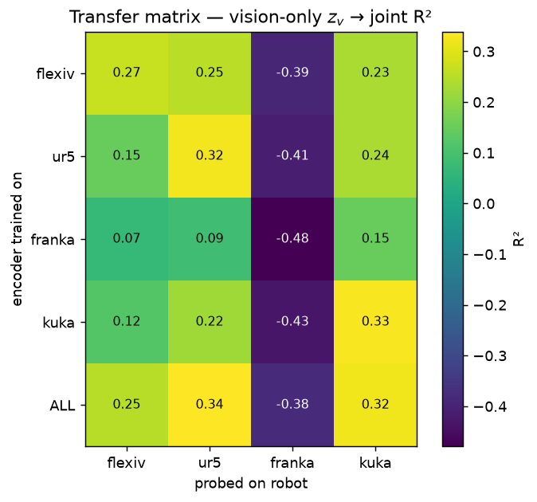

The ALL row (bottom) is the brightest learned encoder in nearly every column; specialist
rows go dark off-diagonal — "one encoder for all robots" at a glance. (franka column is dark
for everyone — the tiny, force-blind config where the motor probe is near-hopeless.)

**Transfer matrix — vision-only `z_v` → FORCE/EE R²** (franka has no F/T sensor):

| trained ↓ \ probed → | flexiv | ur5 | kuka |
|---|---|---|---|
| flexiv | **0.286** | 0.137 | 0.247 |
| ur5 | 0.135 | **0.156** | 0.247 |
| franka | 0.059 | 0.029 | 0.102 |
| kuka | 0.106 | 0.119 | **0.432** |
| **ALL** | 0.268 | **0.187** | 0.393 |
| *raw ViT* | 0.211 | 0.103 | *0.353* |

RankMe (`z_v`): healthy on ALL (mean 171) and ur5 (180); **lower on franka (148) and kuka
(147)**, with **per-seed collapse dips** (flexiv min 64; ~13% of encoder×robot values <140) —
not fully collapse-free; the dip seeds are worth a re-run. (Per-(encoder,robot) RankMe partly
tracks probe-set size/diversity, so the franka/kuka lows are partly that; the flexiv=64 seed
is a genuine flag.) PCA-256 control ≈ raw (both fit on train rows only; omitted for space).

**Findings (final, 5-seed):**
- **One encoder for all robots — holds.** ALL is **statistically indistinguishable from each
  specialist on its own robot** (ties within 1 seed-std in every diagonal cell; the one
  outright win is ur5 *force*, ALL 0.187 vs 0.156). On-diagonal the specialist is nominally
  higher on flexiv & kuka, ALL on ur5 & franka — all within noise. The decisive result is
  **off-diagonal dominance**: on ur5, ALL 0.339 vs the best *wrong* specialist 0.254 (flexiv) /
  0.236 (kuka) / 0.088 (franka). A specialist doesn't transfer; the generalist matches four
  specialists *and* transfers — it learned *robots*, not one robot.
- **Force/EE = the clean cross-modal win.** ALL `z_v` beats raw vision on the F/T + pose
  probe for **every** sensored robot (+0.06 flexiv, +0.08 ur5, +0.04 kuka).
- **Motor: ALL beats raw on 3 of 4** (flexiv, ur5, franka); **kuka joints is the lone loss**
  (ALL 0.321, kuka-specialist 0.330, both < raw 0.391). Vision already infers joint pose;
  force is where fusion earns its keep.
- franka own-robot R² is negative for all (tiny, force-blind cfg5), but ALL (−0.377) is far
  more stable than raw's catastrophic −6.7 and beats the franka specialist (−0.479).

**1.7 triplet accuracy** (ALL, seed 0; positive = same scene / nearby tick; `eval_extras.py`):

| negative tier | acc (mse) | acc (cosine) |
|---|---|---|
| diff scene, same robot (hard) | 0.930 | 0.946 |
| diff robot (easy) | 0.992 | 0.997 |

Both tiers well above chance with positive margins — the latent's geometry is right (nearby
world-states near; different scenes/robots far). RankMe 177.5.

**1.8 PCA figures** — the ALL encoder's vision-only `z_v` clusters cleanly by embodiment
(kuka / ur5 / flexiv distinct; franka partly overlaps flexiv), with meaningful shared
structure:

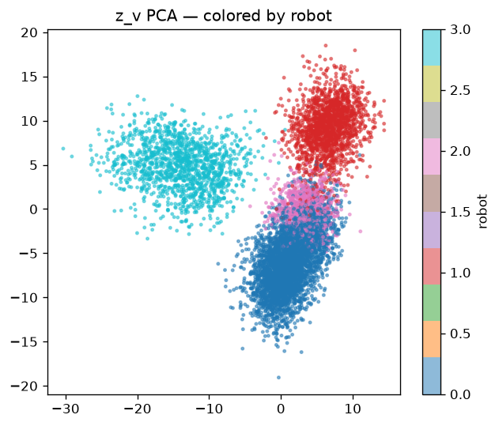

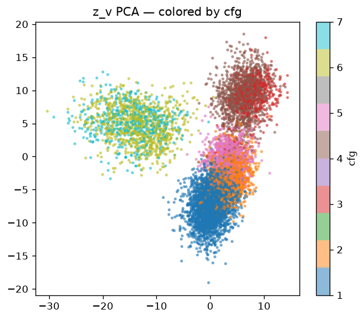

Fusion vs baselines (ALL encoder, per robot) — `z_v` beats raw ViT + PCA on force everywhere;
on joints it wins except kuka:

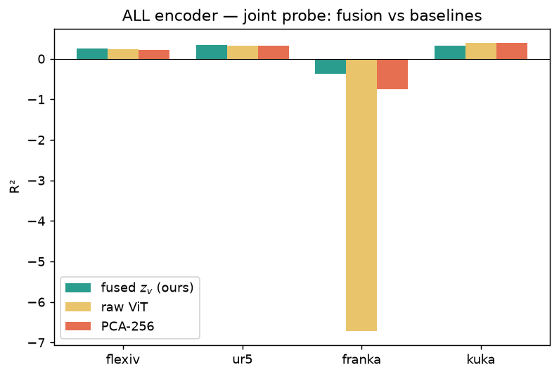

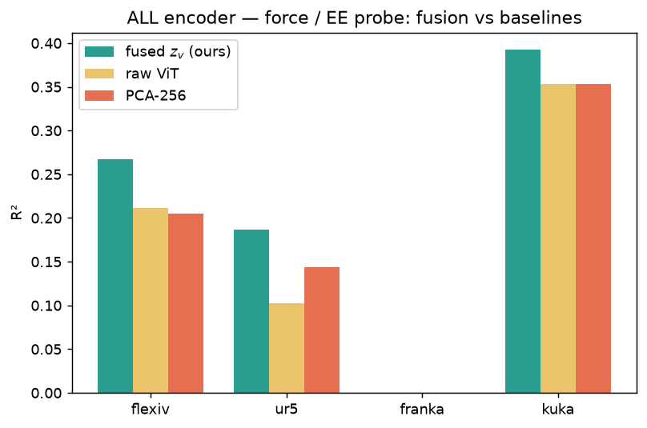

Within a single robot (ur5), `z_v` organizes by **gripper state** — a clean open→closed
gradient — evidence the latent encodes continuous world-state, not just robot identity
(force magnitude does *not* surface in PCA — it's the hard-from-vision signal the probe R²
measures, not a scatter):

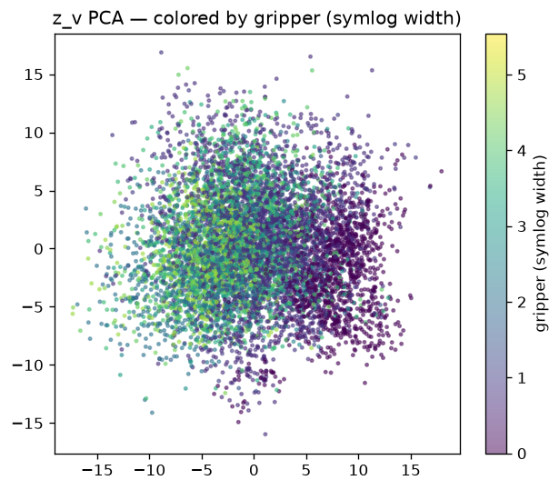

**kuka-joints diagnostic** (why raw beats fusion in that one cell): per-motor-dim probe on
kuka shows raw ViT reads kuka *joint angles* superbly (0.8–0.9 R² on the sin/cos dims) —
the 7-DOF arm is large and fully visible in the fixed view — while the 256-d fused `z_v`
gives up some joint-angle fidelity for multimodality (mean 0.39 vs raw 0.51). So the lone
negative cell is a **bottleneck/compression tradeoff on the robot where vision is most
competent**, not a fusion failure (the d=512 ablation tests whether capacity recovers it).

### 1.6 Ablations (all 5-seed, complete)

**Cross-modal gain — fused vs vision-only-*trained* (the key control).** Identical 256-d
Perceiver, same data/compute; only difference is whether state was fused. ALL encoder,
own-robot:

| robot | fused `z_v` motor | vision-only motor | Δ | fused ee | vision-only ee | Δ |
|---|---|---|---|---|---|---|
| flexiv | 0.252 | 0.137 | **+0.12** | 0.268 | 0.122 | **+0.15** |
| ur5 | 0.339 | 0.198 | **+0.14** | 0.187 | 0.085 | **+0.10** |
| kuka | 0.321 | 0.258 | **+0.06** | 0.393 | 0.220 | **+0.17** |
| franka | −0.377 | −0.352 | −0.03 | — (no F/T) | — | — |

Fusion adds **+0.06–0.14 (joints)** and **+0.10–0.17 (force)** on the three data-rich robots.
Since architecture and compute are identical, this is *purely cross-modal fusion* — it rules
out "the gain is just in-domain training." (franka is a wash: tiny, force-blind config, both
near-degenerate.) The 4 specialists show the same pattern. RankMe healthy (~180–195) for both.

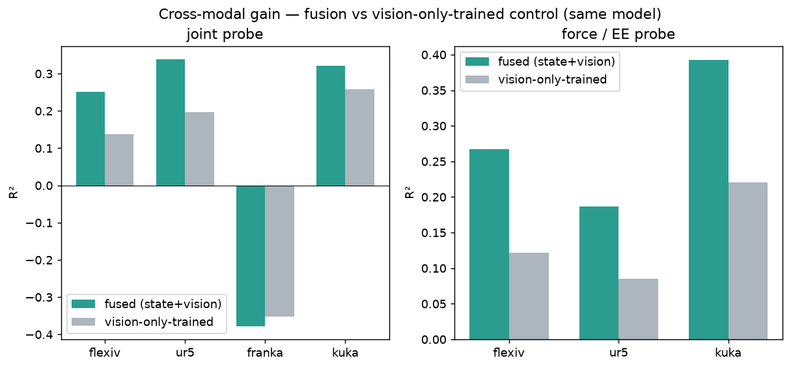

**Bottleneck sweep** (ur5, motor/ee, 5-seed): d=128 → 0.356/0.147 · d=256 → 0.324/0.156 ·
d=512 → **0.255/0.122 with unstable RankMe (123 ±111 — some seeds collapse)**. Robust across
**d=128–256; larger (512) degrades and destabilizes** — a clear sweet spot, not
over-parameterized. (Enlarging the bottleneck does *not* recover kuka joints.)

**Joint-SIGReg on/off** (ur5): off → 0.357/0.173 vs on (matrix) 0.324/0.156 — essentially no
change. The joint regularizer isn't load-bearing at this scale (consistent with "only
rebalance the losses if the combo misbehaves — it hasn't").

**Phase-1 gate — PASSED:** joint encoder ≥ specialists in-domain ✓ · positive cross-embodiment
transfer ✓ · no recipe-level collapse (ALL/ur5 RankMe healthy; per-seed dips on franka/kuka/
flexiv flagged for re-run) ✓ · ablations survive (cross-modal gain confirmed, recipe robust) ✓.
Owed only cosmetically: triplet is done (§1.7); the single-timestep story is complete —
next is the downstream / usefulness track (below).

## Downstream (2026-07-07 pivot) — usefulness on the frozen encoder

Per the office call, temporal is parked; focus is concrete applications on the frozen
Phase-1 encoder (see PLAN.md "Direction — downstream-first").

**What this track proves (and what it doesn't).** The core scientific claims — fusion makes the
vision latent carry force, one-encoder-for-all, cross-modal not compression/in-domain — are
established by the **transfer matrix + ablation** (§1.6), *not* by anything below. This track
proves a different thing: the frozen encoder is **useful** and its latent is **rich enough to act
on**. Surprise is the one with a genuine standalone application (robot safety); the decoders are
"what the latent knows" demonstrations. The pixel/cross-modal decodes are qualitative demos, not
evidence for the fusion (that lives in the probes).

### Invalid-state surprise / safety detector
The encoder is trained by cross-modal prediction, so its per-sample prediction error is a
built-in **surprise** signal (`world_tokenizer/surprise.py`, `MMPerceiverChunks.surprise()`):
low when the robot state is consistent with vision, high when it isn't. No new training.
ALL encoder on ur5 held-out (n=12,930), valid vs corrupted state:

| corruption | valid μ | corrupted μ | AUROC |
|---|---|---|---|
| out-of-range state (large noise) | 1.18 | 6.41 | **0.90** |
| mismatched state (from another scene) | 1.18 | 1.76 | 0.69 |

Cleanly flags gross/out-of-range anomalies (0.90); modest on subtle mismatches (0.69). A
direct robot-safety anomaly detector on the encoder we already have.

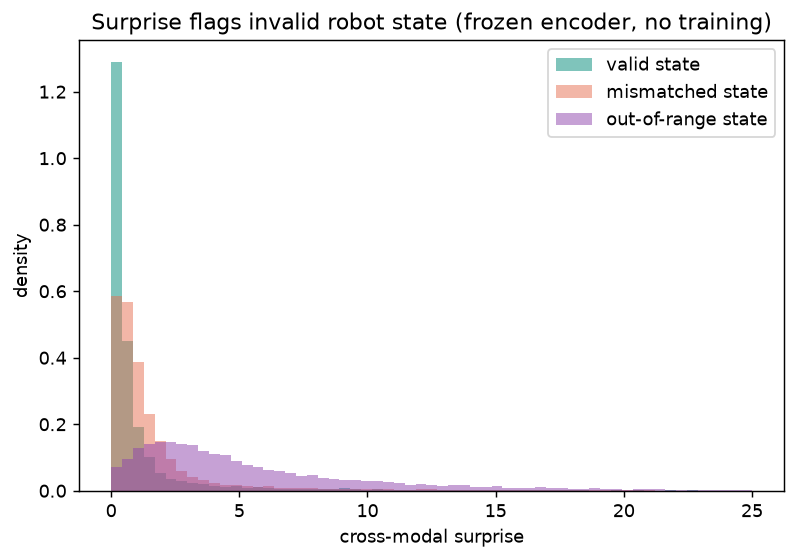

### robot_state decoder — "superpowered probe" (PLAN 3.1)
A small MLP decodes the **frozen** vision-only `z_v` → joint state (encoder frozen; only the
decoder trains, minutes). On ur5 held-out (n=12,930) it reconstructs state at **R² 0.444** vs
the linear probe's **0.335** (+0.11) — the latent carries more state than a linear readout
shows. Per-dim: joint angle R²=0.69. Gripper is ~discrete (open/closed), so R² is misleading there (flagged by JQ/Nicole) — as **classification** it's **78% acc / 0.87 AUROC** from `z_v` (vs 50% chance; raw ViT 0.77/0.86), i.e. the latent cleanly carries gripper state. (`state_decoder.py`, `gripper_classify.py`)

### Pixel decode — reconstruct the frame from z_v (PixNerd)
A small latent-conditioned diffusion decoder (PixNerd) regenerates the robot's **camera frame**
from the frozen **vision-only `z_v`** (`pixnerd_integration/`: LatentConditioner feeds z_v as the
condition; RobotLatentDataset pairs frame↔z_v; PixelAE pixel-space; plain flow-matching; 8-GPU
DDP with `NCCL_P2P_DISABLE=1`). Decoded frames are **recognizable and match the reals** — scene
layout, table/surface, colors, rough arm/object placement — but **blurry by design**: the 256-d
latent keeps world-state and drops fine texture (world-*encoder*, not autoencoder), so the decode
shows what the latent kept vs discarded. **Final 30k-step checkpoint** (ur5; qualitative); the
blue mat, wood-grain table, green pool table, and object/arm placement all come back cleanly,
arm region the roughest.

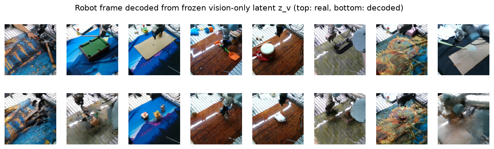

**Replay GIFs** (`make_gif.py`): decode a held-out episode's *latent trajectory* frame-by-frame
into a video — real (top) vs decoded-from-`z_v` (bottom) playback. This is reconstruction/replay
of a real trajectory, **not** future prediction (true world-model rollout needs the parked
temporal model). Final 30k, **3 distinct held-out tasks** chosen to show the full extent — decode
quality tracks **scene complexity**: simple scenes reconstruct cleanly, cluttered / fine-detail
scenes degrade (the "keeps world-state, drops fine texture" tradeoff made visible):

- `replay_0.gif` — task_0004, **blue mat**: clean (mat, pink region, arm, objects all recover).
- `replay_1.gif` — task_0008, **cardboard sheet**: degrades (the tan sheet blurs to a light smear).
- `replay_2.gif` — task_0010, **multi-object clutter**: fails (small objects smear to blobs).

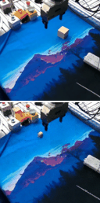

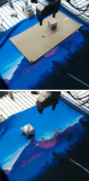

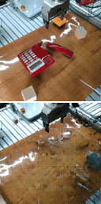

**Cross-modal decode (Variant 2, DONE — 30k).** Mirror experiment: same PixNerd decoder, but
conditioned on the **state-only** latent `z_state` (vision hidden, motor+ee only — `embed_state`,
`precompute_decode --latent state`, `decode_ur5_state_128.yaml`). **Result matches the up-front
expectation exactly:** the **arm/gripper comes back in roughly the right pose** (joints→pose ≈
forward kinematics) and generic table/floor structure appears, but the **actual scene is lost** —
mat colors, objects, the pool table are replaced by generic guessed surfaces (that content isn't
in force/joints). So: **proprioception reconstructs the robot, not the world** — a shared-latent-
space demonstration, and an honest negative on scene content. Qualitative; not evidence for fusion.

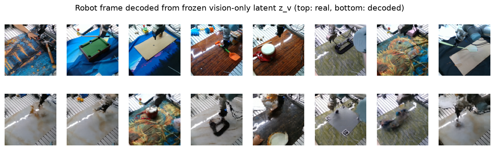

Replay GIFs (state-only): `figures/decode/gifs_state/replay_{0,1,2}.gif`.

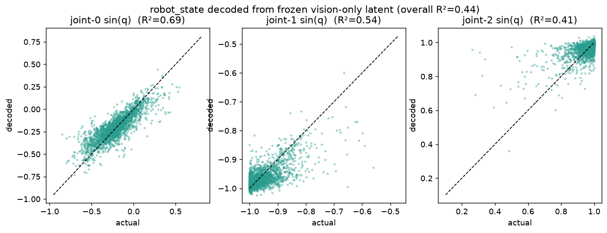

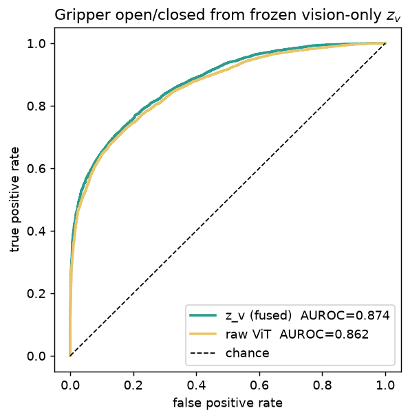

### Metrics audit (2026-07-07, code inspection)
Re-verified before standing behind results: **no train/test leakage** — group-held-out
split; StandardScaler / PCA / Ridge all fit on train rows only; targets per-sample.
**franka's −6.7 raw R²** is a genuine degenerate-probe artifact (tiny config, 768-d probe,
group shift), not a bug → keep franka out of headline claims. **d=512 RankMe instability** is
real (some seeds collapse). Minor: Ridge α=10 fixed + targets unstandardized → R²
scale-sensitive per-dim, but apples-to-apples across z_v/raw/pca so conclusions hold.
